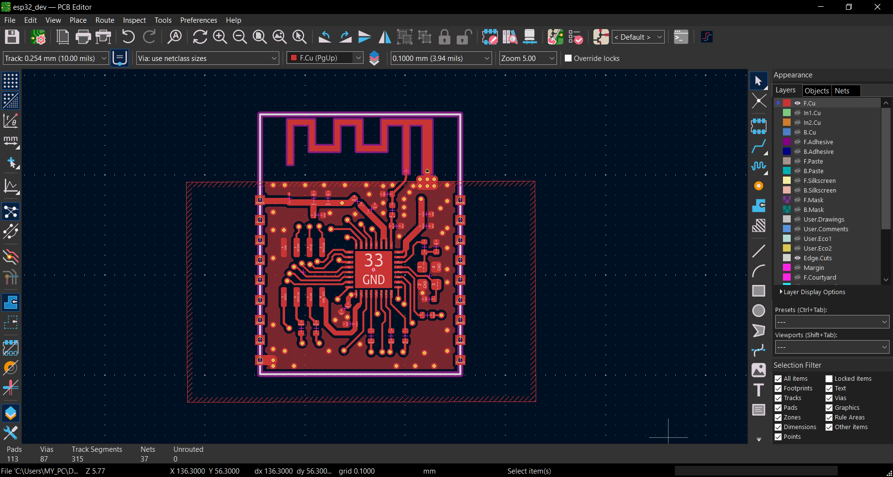
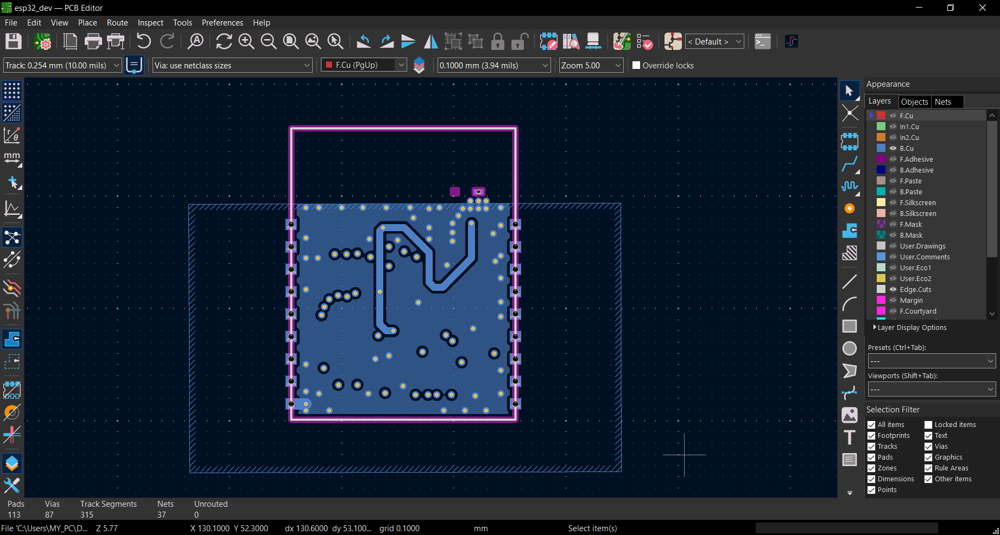
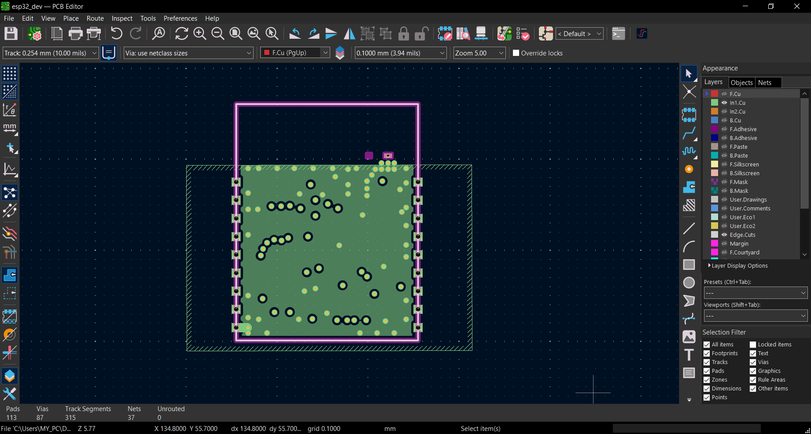
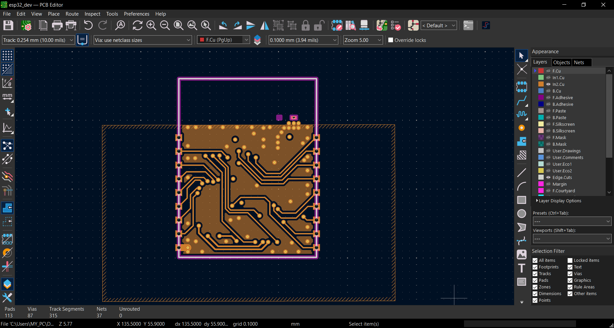
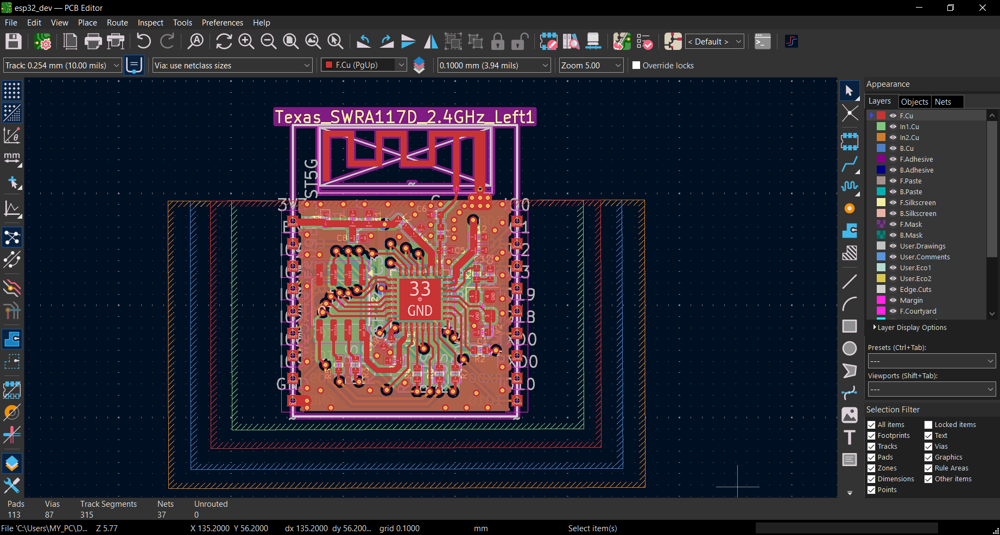
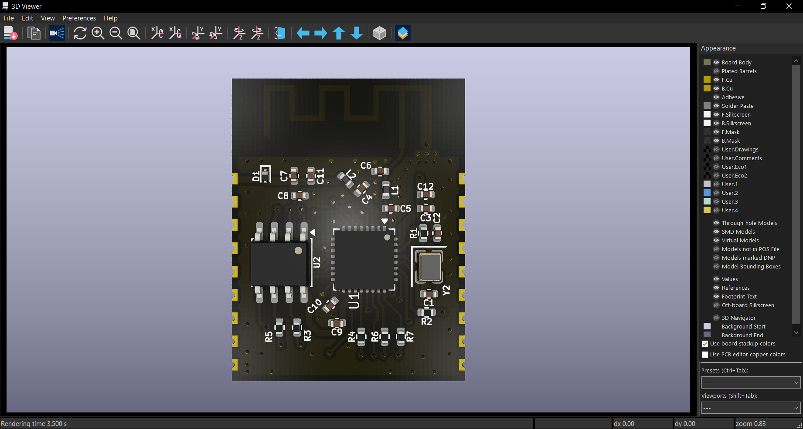
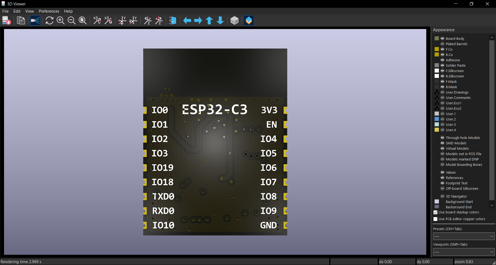
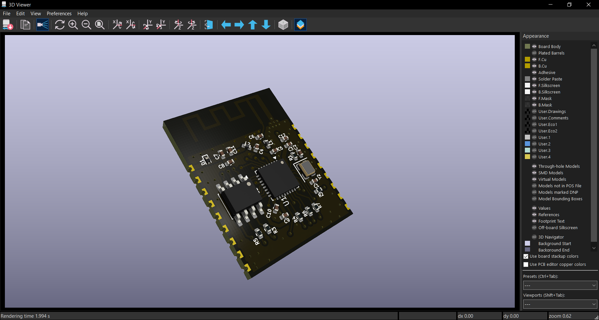

## PCB Design Details
## Overview

This project is an educational recreation of an **ESP32-C3 module** designed
in **KiCad** using publicly available **Espressif** reference schematics,
hardware design guidelines, and PCB layout recommendations.

The purpose of this project is to study and better understand:
- ESP32-C3 hardware design
- PCB layout and routing practices
- Power regulation design
- RF design considerations

This project was created solely for educational and learning purposes.
It is not an official Espressif design, product, or reference module.
All design references and technical resources belong to their respective owners.

## Antenna Design

The PCB antenna footprint used in this project was referenced from the
official KiCad RF antenna footprint library:

- [KiCad RF Antenna Footprints](https://kicad.github.io/footprints/RF_Antenna.html)
- You can download the library [here.](https://kicad.github.io/download/footprints/RF_Antenna.pretty.7z)

A custom schematic symbol was created for the
`Texas_SWRA117D_2.4GHz_Left` PCB antenna to integrate it into the
ESP32-C3 schematic and PCB design workflow.
> Note: RF performance and antenna tuning were not professionally validated.
This project is intended for educational and PCB design learning purposes only.
---
### 🔹 Top Layer

---

### 🔹 Bottom Layer

---

### 🔹 Gnd Layer

---

### 🔹 Signal Layer

---

### 🔹 All Layers

---

### 🔹 3D View

## Resources

The following official Espressif resources were used as references during
the design process:

- [Espressif Hardware Design Guidelines](https://docs.espressif.com/projects/esp-hardware-design-guidelines/en/latest/esp32c3/index.html)
- [ESP32-C3 Technical Reference Manual](https://documentation.espressif.com/esp32-c3_technical_reference_manual_en.pdf)
- [ESP32-C3-WROOM-02_Reference_Design](docs/ESP32-C3-WROOM-02_Reference_Design/)

