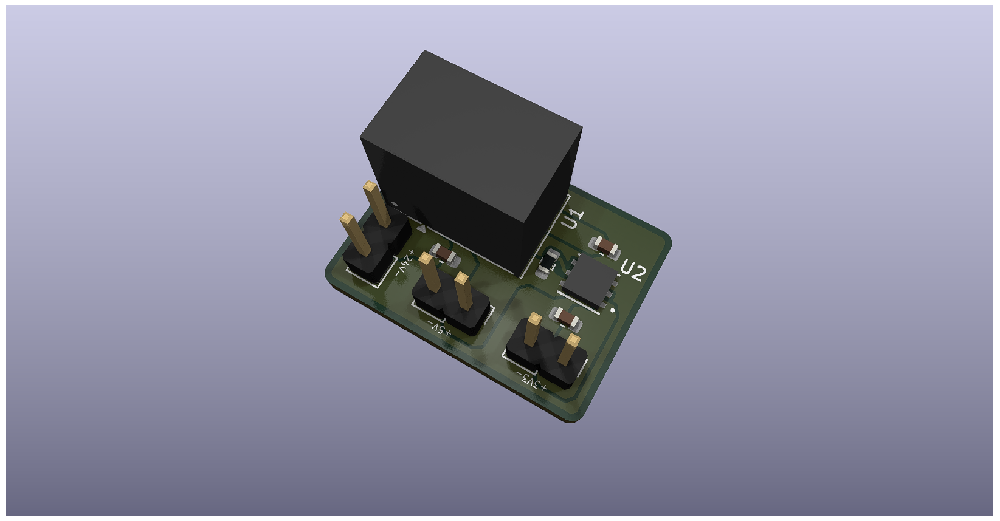
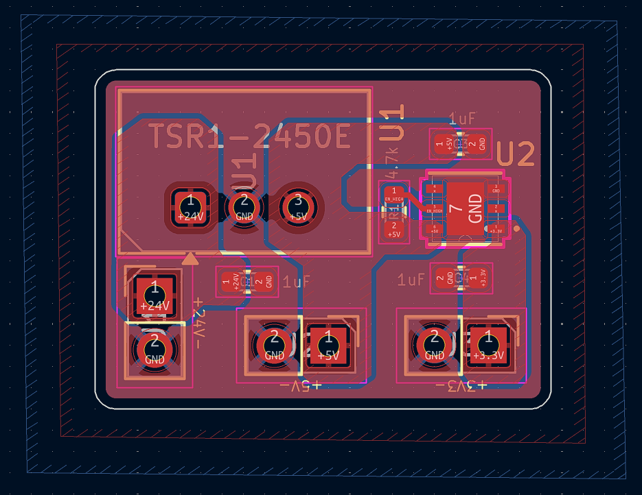
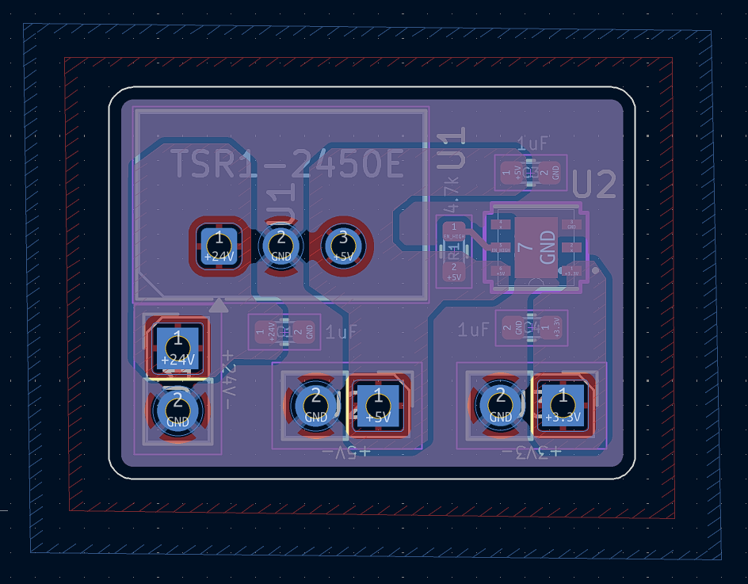

# Power Regulator

## Overview

This is an experimental PCB design focused on power regulation, converting
a **24V DC** input to regulated **5V** and **3.3V** outputs while keeping the
**bill of materials (BOM) minimal**.

### 3D VIEW

### Front Layout

### Front Layout

