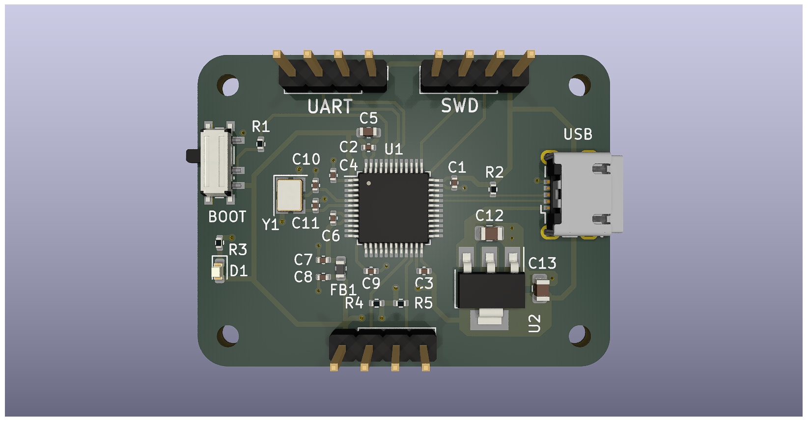
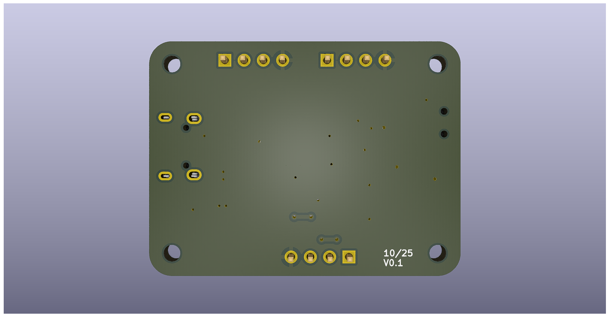
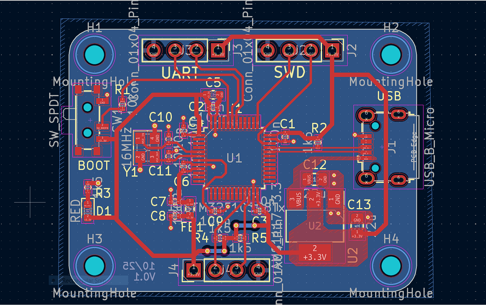

# STM32 DevKit 

## Overview
This repository contains a PCB design recreated in **KiCad** by following a
step-by-step tutorial from the **Phil’s Lab YouTube channel**.  
The project was made for learning and practice purposes.

## Credits
Original tutorial by **Phil’s Lab**  
YouTube Channel: [https://www.youtube.com/@PhilsLab](https://www.youtube.com/@PhilsLab)

### Front View

### Back View

### PCB Layout

